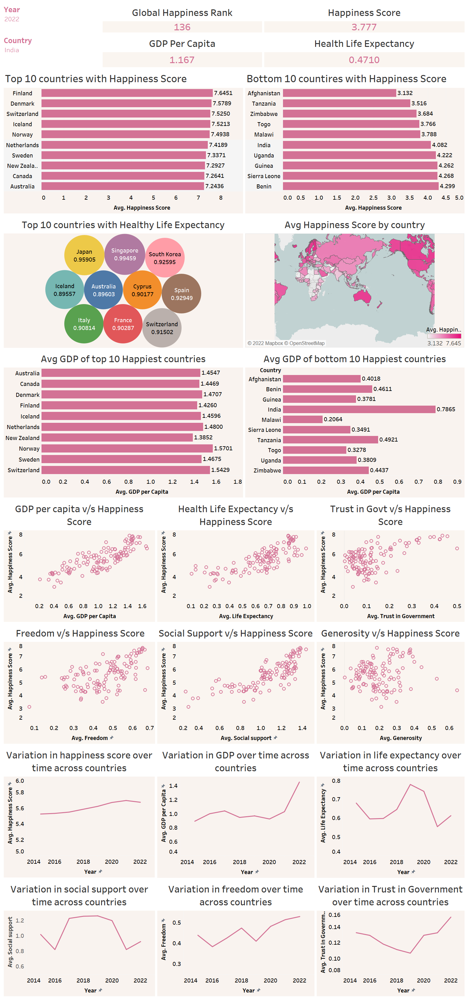

# PROJECT: World-Happiness-Report-Analysis

*😊😊😊 Show some :heart: by giving the repo a ⭐*

💠 **An amazing dashboard project with detailed analysis.**

💠 **Let us analyse and compare the happiness of various countries across the globe.**

💠 **We perform extensive**

     ⭐ Data Pre-Processing
     
     ⭐ Exploratory Data Analysis
     
     ⭐ Visualisation using TABLEAU
     
     ⭐ Draw conclusions and analysis on basis of visualisation/graphs
   
💠 *Technologies Used*

      ✔️ Find data on (https://worldhappiness.report/) for 2015-2022
      
      ✔️ *Python / R* for pre-processing of various years dataset along with combining them
      
      ✔️ Use a new tool *TABLEAU* to create a dashboard with various graphs
      
      ✔️ Analysis of graphs
      
💠 **Have a look at the detailed project report:**
      🌼 Click here : [PROJECT REPORT](https://github.com/JasweenBrar/World-Happiness-Report-Analysis/blob/main/Jasween_102017187_DASHBOARD_PROJECT_Data_Science.pdf)
    
💠 **A glance of our DASHBOARD:**
   
   

